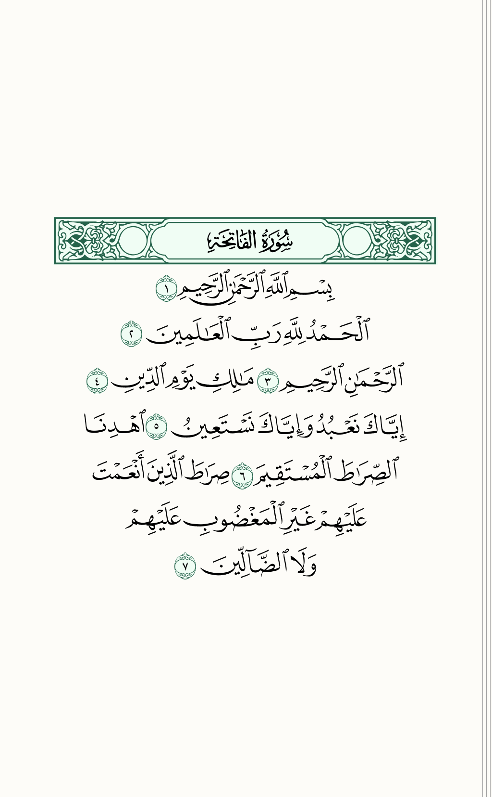
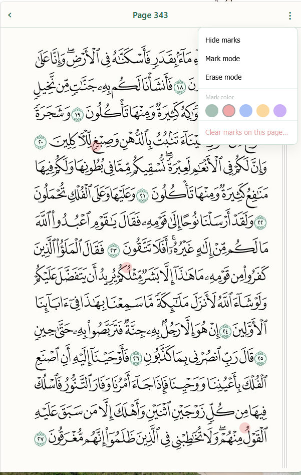
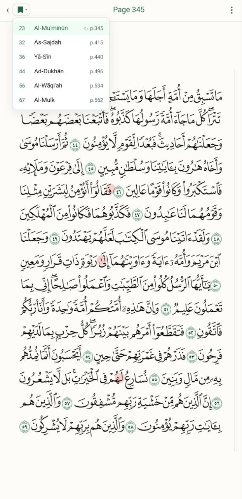

# Python Quran Images (QPC v2 pipeline)

A two-part project:

**1. Image generator** (Python) — renders every page of the Quran as a
PNG using the official **KFGQPC v2** (1421H Madani Mushaf, 604 pages)
font set. PNGs can then be converted to AVIF for compact delivery.



**2. Mobile web reader** (vanilla HTML/JS) — a single-page app that
serves the rendered pages with RTL swipe navigation, page resume, and a
**memorisation-marks** layer so you can tap to flag spots in your hifz
where you tend to make mistakes (with several colors, an erase mode,
and per-page clearing).



Inspired by and originally adapted from
[`quran/quran.com-images`](https://github.com/quran/quran.com-images) —
this is a parallel v2 pipeline using the newer KFGQPC font family and a
simpler SQLite schema.

## Data sources

| What                | Where it comes from                                                       |
|---------------------|---------------------------------------------------------------------------|
| Per-page line DB    | [qul.tarteel.ai](https://qul.tarteel.ai) — `qpc-v2-15-lines.db`           |
| Word / glyph DB     | [qul.tarteel.ai](https://qul.tarteel.ai) — `qpc-v2.db`                    |
| Fonts (QCF2 v2)     | [nuqayah/qpc-fonts](https://github.com/nuqayah/qpc-fonts) `mushaf-v2/`    |
| Tajweed letter data | Adapted from the [Tarteel](https://tarteel.ai) tajweed dataset            |

The fonts and font glyphs are © King Fahd Complex for the Printing of
the Holy Qur'an. Distribute responsibly.

## Layout

```
quranV2/
├── migrate_v2.py        # builds quran_v2.db from the QPC v2 source DBs
├── generate.py          # renders pages -> output/<n>.png
├── to_avif.bat          # converts output/*.png -> output-avif/*.avif
├── setup.bat            # one-time: downloads fonts from nuqayah/qpc-fonts
├── src/                 # generator + db + tajwid modules
├── res/fonts/           # 605 .ttf files (gitignored, populated by setup.bat)
├── qpc-v2-15-lines.db/  # source page layout DB
├── qpc-v2.db/           # source word/glyph DB
├── quran-tajweed.json   # tajweed letter ranges
└── webapp/              # single-page Quran reader (vanilla HTML/JS)
```

Generated outputs (`quran_v2.db`, `output/`, `output-avif/`) and the
fonts (`res/fonts/*.ttf`) are gitignored — they're large and reproducible.

## Quick start

```bat
:: 1. Download the 605 QPC v2 fonts (one-time, ~200 MB)
setup.bat

:: 2. Build quran_v2.db from the bundled source DBs
python migrate_v2.py

:: 3. Render every page as a 1024-px-wide PNG
python generate.py --pages 1..604 --width 1024

:: 4. Convert PNGs to AVIF (much smaller; requires ffmpeg with libaom-av1)
to_avif.bat output output-avif

:: 5. Serve the web reader (any static server works; Python's is easiest)
python -m http.server 8765 --bind 0.0.0.0
::    -> open http://localhost:8765/webapp/  on this machine
::    -> open http://<your-lan-ip>:8765/webapp/  from your phone (same Wi-Fi)
```

## Step-by-step

### 1. Download fonts (`setup.bat`)

The 605 QPC v2 TTF fonts (`QCF2001.ttf` ... `QCF2604.ttf` plus
`QCF2BSML.ttf`) live in
[`nuqayah/qpc-fonts`](https://github.com/nuqayah/qpc-fonts) under
`mushaf-v2/`. `setup.bat` sparse-clones just that folder into
`res/fonts/`. Requires `git` 2.25+ on PATH. Idempotent — re-running it
skips the download if fonts are already present.

Manual alternative: clone or zip-download `nuqayah/qpc-fonts` and copy
the contents of `mushaf-v2/` into `res/fonts/`.

### 2. Build the database (`migrate_v2.py`)

Combines `qpc-v2-15-lines.db` (page layout) and `qpc-v2.db` (per-word
glyphs) into a single `quran_v2.db` with three tables:

- `pages(page_number, line_number, position, line_type, font_file,
  glyph_code, surah_number, is_centered)` — one row per PUA glyph
- `words(word_id, page_number, line_number, position, sura_number,
  ayah_number, word_position, arabic_text, glyph_code, font_file)`
- `page_bboxes(...)` — populated at render time

```bash
python migrate_v2.py
```

### 3. Render PNGs (`generate.py`)

```bash
python generate.py --pages 1..604 --width 1024
python generate.py --pages 1            # single page
python generate.py --pages 1,5,7..10    # mixed ranges
python generate.py --pages 1 --tajwid   # per-letter colouring (needs anchor data)
```

Output goes to `output/<page>.png`. Height is golden-ratio derived from
`--width`. A 1024-px width produces ~1024×1656 PNGs.

### 4. Convert to AVIF (`to_avif.bat`)

PNG-to-AVIF using ffmpeg (libaom-av1, CRF 30, still-picture). AVIFs are
roughly 70 % smaller than the PNGs while staying visually identical.

```bat
to_avif.bat                       :: defaults: output\ -> output-avif\
to_avif.bat src_folder dst_folder :: custom folders
```

Requires `ffmpeg` on PATH with libaom-av1 enabled (any modern build).
Skips files that already exist in the destination.

### 5. Run the web reader (`webapp/`)

```bash
python -m http.server 8765 --bind 0.0.0.0
```

Open `http://localhost:8765/webapp/` on the same machine, or
`http://<lan-ip>:8765/webapp/` from a phone on the same Wi-Fi.

Webapp features:

- Surah list with search and an **All / Bookmarks** tab filter
- RTL swipe navigation between pages (preloads neighbours so swipes feel
  instant), keyboard ← → fallback
- **Bookmarks with resume-page**: bookmark a surah from two places — the
  star icon next to each row in the surah list, or the ⋮ menu while
  reading. Each bookmarked surah remembers the last page you were on, so
  jumping back resumes where you left off. A small bookmark icon in the
  viewer header opens a dropdown to switch between bookmarked surahs
  (only shows when you have at least one). Bookmarks live in
  `localStorage` (`quran:bookmarks` + `quran:lastPageBySurah`).

  

- **Memorisation marks**: in *Mark mode*, tap a spot on a page to drop a
  semi-transparent dot in your chosen colour (red, green, blue, amber,
  purple). In *Erase mode*, tap near any dot to delete just that one.
  Marks are stored in `localStorage` (`quran:marks`) keyed per page, so
  they sync nowhere — purely on-device.
- Hide-marks toggle for clean reading
- Per-page "Clear marks" with confirmation
- Resume to last page on fresh launch
- Wake-lock so the screen doesn't sleep while reading
- PWA with offline-capable service worker — Add to Home Screen on HTTPS
  gives an app-like standalone view, and updates auto-propagate on next
  launch (no manual cache clearing needed). If a user ever gets stuck
  on a stale shell, opening `webapp/reset.html` once unregisters the
  service worker and refreshes the HTTP cache.

The reader expects `output-avif/` to sit next to `index.html` at deploy
time. If your folder layout differs, set
`window.QURAN_AVIF_BASE = "<path-or-url>"` in `index.html` before
loading `viewer.js`.

## License

MIT for the Python pipeline and webapp. The bundled fonts are © King
Fahd Complex; redistribution should follow the upstream font license.
